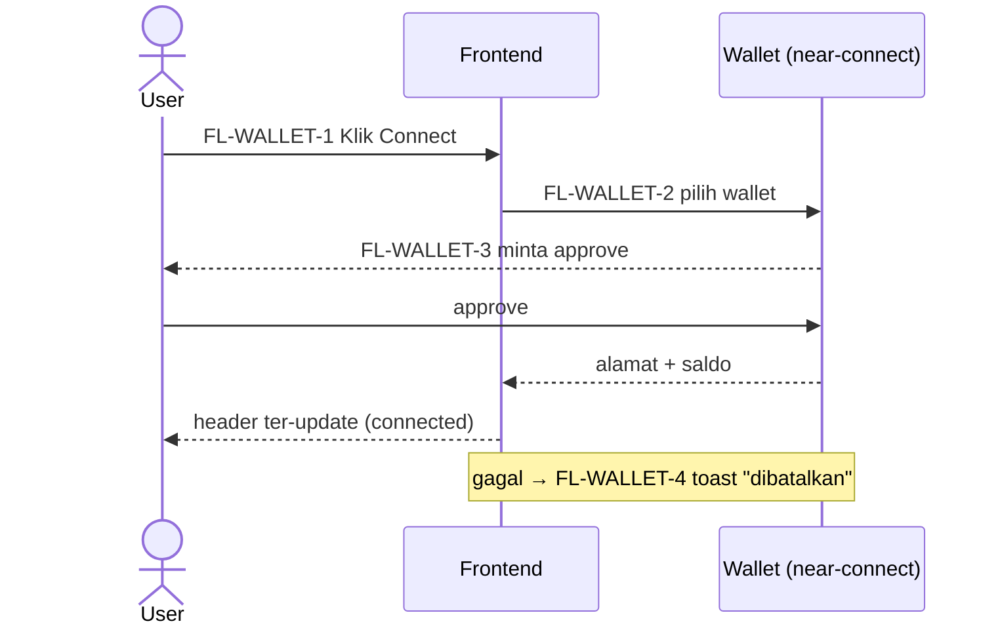
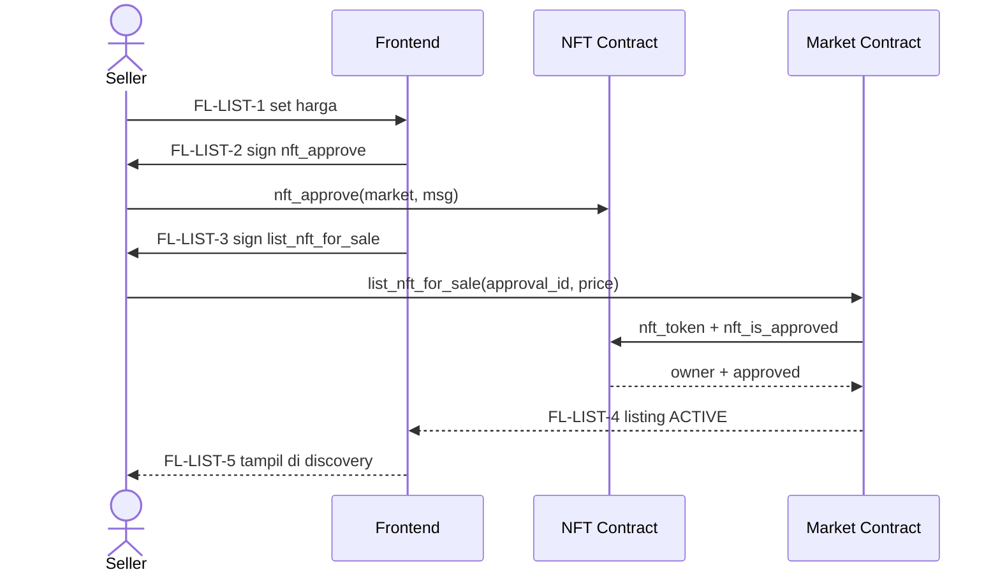
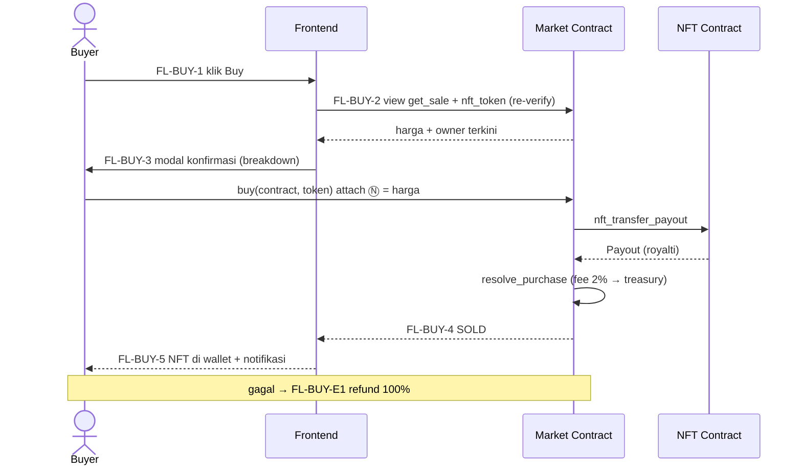
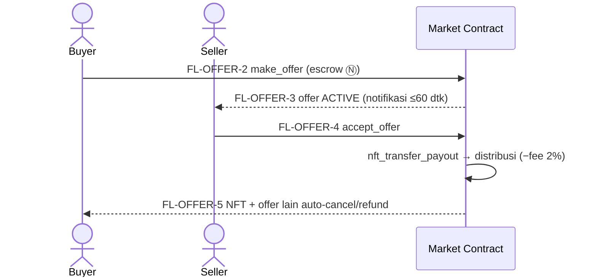

# 03 — User Flows

> Perjalanan user, diagram teks sederhana. Satu flow per kemampuan besar (termasuk cabang error utama).
>
> **Step ID**: tiap langkah di bagian Spec Flow punya ID stabil `FL-<AREA>-<n>` — dipakai di telemetry, test E2E, dan PR. Diagram ASCII di atas tetap kanonik untuk urutan; tabel Spec Flow menambah timing, route, dan telemetry.

## Konvensi

| Label | Arti |
|---|---|
| `FL-<AREA>-<n>` | Step ID stabil |
| **Pre → Post** | State sebelum → sesudah langkah |
| Route | Halaman tempat langkah terjadi ([frontend-architecture.md](./architecture/frontend-architecture.md) §2) |
| Timing | Ekspektasi latensi (target UX, PROPOSED kecuali dinyatakan FACT) |
| Telemetry | Nama event analytics (PROPOSED — tanpa PII) |
| ⏳ open-by-design | Belum diputuskan |

## Connect Wallet

```text
Landing / Browse
     ↓
Klik "Connect Wallet"
     ↓
Pilih wallet (near-connect: HOT / Meteor / Nightly / …)
     ↓
Wallet Signature / Login ──✗ user tolak → toast "dibatalkan", state disconnected
     ↓
Terhubung → alamat + saldo tampil di header
```

## Onboarding (newcomer — ronde 8)

```text
Landing → "Panduan" / halaman /onboarding
     ↓
Langkah: buat wallet (link resmi) → faucet testnet → connect wallet
     ↓
Transaksi pertama terpandu (mint murah / beli) + tips keamanan (domain resmi, cek harga di wallet)
```

## Browse & Discover

```text
Home (search bar + grid listing, sort/filter)
     ↓
Klik NFT / koleksi
     ↓
Detail NFT (harga, riwayat, offers, tombol Buy/Make Offer)
Error: data gagal load → retry + empty state
```

## Mint NFT (launchpad — ronde 10)

```text
Halaman koleksi → tab Mint
     ↓
Sistem cek fase aktif + eligibility (allowlist on-chain) ──✗ bukan allowlist / fase belum mulai → ditolak
     ↓
Pilih jumlah → konfirmasi harga fase
     ↓
Sign nft_mint (deposit = harga fase + biaya storage mint)
     ↓
NFT masuk wallet → tampil di profil + notifikasi
```

## Create Collection (factory + launchpad — ronde 10)

```text
Klik Create (top-nav) → login wallet
     ↓
Form: metadata + supply policy (fixed/open, tanpa cap) + royalti ≤ 10%
     ↓
Setup phases bebas: [Whitelist 2Ⓝ 24jam + allowlist.csv] → [Public 5Ⓝ ∞] → …
     (allowlist diupload SEBELUM deploy — bagian form)
     ↓
Review → deploy via factory ──✗ gagal → error + retry
     ↓
Koleksi live di discovery
```

## List NFT (approval model — ronde 9)

```text
Profil → pilih NFT → Sell
     ↓
Set harga (min 0.01 Ⓝ) → Tx 1 nft_approve (signing 1/2) ──✗ tolak → batal
     ↓
Tx 2 list_nft_for_sale (signing 2/2)
     ↓
Dual verification → listing aktif; NFT tetap di wallet
```

## Cancel / Update Price

```text
Profil → listing milik sendiri → Cancel / Edit Price
     ↓
Sign (1 yocto) ──✗ bukan owner → revert kontrak
     ↓
Cancel: listing hilang + approval dicabut | Update: harga baru tampil
```

## Buy NFT

```text
Detail NFT → klik Buy (harga + ownership re-verify via view call) ──✗ sudah terjual/stale → tombol disabled
     ↓
Modal konfirmasi: harga + fee 2% + royalti breakdown
     ↓
Sign transaksi buy (deposit = harga)
     ↓
Settlement on-chain (buy → nft_transfer_payout → callback resolve_purchase)
     ↓
NFT di wallet buyer; seller + royalti terbayar; notifikasi
     └─✗ gagal → refund otomatis + toast "dana kembali"; listing tetap ada
```

## Make Offer → Accept Offer

```text
Buyer: Make Offer (jumlah ≥ 0.01Ⓝ, durasi default 7 hari) → sign make_offer (escrow Ⓝ)
     ──✗ offer kedua / self-offer / < min → ditolak
     ↓                                              ↓ expire / cancel
Seller: notifikasi → Accept ─────────────────► refund otomatis ke buyer
     ↓
accept_offer → settle: NFT ke buyer, escrow terdistribusi (seller + royalti − fee 2%)
```

## Private Listing

```text
Seller: Sell → centang "Private" → isi alamat buyer → list (2 tx)
     ↓
Buyer lain membuka → tombol Buy disabled ("khusus <alamat>")
     ↓
Buyer yang ditunjuk → beli → settlement normal (fee + royalti)
```

## Bundle (satu harga — ronde 6)

```text
Seller: pilih maks 10 token miliknya → "Jual sebagai Bundle" → set SATU harga → approve semua token
     ↓
Buyer: buka bundle → beli (deposit = harga bundle)
     ↓
Settlement loop nft_transfer_payout per token ──✗ gagal pre-validasi/gagal tengah → abort/ kompensasi G7 (INV-025)
     ↓
Semua NFT di wallet buyer; royalti per token dijumlahkan; fee dipotong sekali
```

## Edit Profil Custom

```text
Settings → ubah alias/bio/avatar
     ↓
Challenge → wallet sign (NEP-413 / fallback)
     ↓
PATCH /api/accounts/me/profile ──✗ signature gagal → retry
     ↓
Profil publik ter-update
```

## Notifications

```text
Bell header (unread badge) → dropdown daftar
     ↓
Polling NearBlocks + view call tiap 30–60 dtk saat tab aktif
     ↓
Tipe: offer diterima / offer di-accept / token terjual / mint berhasil / offer expire
     ↓
Klik → navigasi ke item terkait; read-state localStorage
```

## Refund / Failed Transaction

```text
Settlement gagal (promise error / payout tidak valid)
     ↓
resolve_purchase memvalidasi → refund buyer 100% (Promise transfer)
     ↓
UI: toast gagal + dana kembali; listing tetap ada
```

## Stale Listing (auto — ronde 9)

```text
Seller memindah NFT di luar market saat listing aktif
     ↓
Marketplace deteksi ownership mismatch (saat view/offer/buy)
     ↓
Listing auto-stale → sembunyi dari discovery (ala auto-cancel OpenSea)
```

## Admin Moderation (report system — ronde 3)

```text
User klik Report → pilih alasan → kirim (signature wallet)
     ↓
Admin login panel (/admin — allowlist + wallet signature)
     ↓
Antrean review → putuskan: abaikan / sembunyikan dari discovery (step-up signature)
     ──✗ signature step-up gagal → aksi tidak dieksekusi
     ↓
Takedown hanya layer tampilan — chain tidak tersentuh
```

---

## Spec Flow (Step ID, Timing, Route, Telemetry)

> Melengkapi diagram ASCII di atas. Setiap tabel = satu flow; kolom **Pre → Post** menandai transisi state per langkah. Timing = target UX; telemetry = event analytics (tanpa PII; signature/seed/alamat lengkap **tidak** dikirim — [development/error-handling.md](./development/error-handling.md) §7).

### Connect Wallet — Step Table

| Step | Aktor | Aksi | Pre → Post | Route | Timing | Telemetry |
|---|---|---|---|---|---|---|
| FL-WALLET-1 | User | Klik "Connect Wallet" | disconnected → picker-open | `/` (header, semua) | <100 ms | `wallet_connect_clicked` |
| FL-WALLET-2 | User | Pilih wallet | picker-open → connecting | (modal) | <500 ms | `wallet_selected` |
| FL-WALLET-3 | Wallet | Approve | connecting → approving → connected | (modal) | ≤10 dtk (user-bound) | `wallet_connected` |
| FL-WALLET-4 | User | (gagal/tolak) | approving → rejected | (modal) | — | `wallet_rejected` |
| FL-WALLET-5 | Sistem | Network mismatch | connected → mismatch | (banner) | — | `wallet_network_mismatch` |



### List NFT — Step Table

| Step | Aktor | Aksi | Pre → Post | Route | Timing | Telemetry |
|---|---|---|---|---|---|---|
| FL-LIST-1 | Seller | Buka Sell, set harga | owned → form-open | `/token/:c/:id` | <100 ms | `list_started` |
| FL-LIST-2 | Seller | Tx-1 `nft_approve` | form → approving-1 | (modal) | sign user-bound | `list_approve_submitted` |
| FL-LIST-3 | Seller | Tx-2 `list_nft_for_sale` | approving-1 → approving-2 | (modal) | sign user-bound | `list_submit_submitted` |
| FL-LIST-4 | Kontrak | Dual verification | approving-2 → ACTIVE | — | ≤ finality (~1–3 dtk) | `list_confirmed` |
| FL-LIST-5 | Sistem | Invalidate query + tampil di discovery | ACTIVE → visible | `/` | <1 dtk | — |
| FL-LIST-E1 | Seller | Tolak/error | * → form | (modal) | — | `list_failed` |



### Buy NFT — Step Table

| Step | Aktor | Aksi | Pre → Post | Route | Timing | Telemetry |
|---|---|---|---|---|---|---|
| FL-BUY-1 | Buyer | Buka detail, klik Buy | browse → verify | `/token/:c/:id` | <1 dtk (view) | `buy_started` |
| FL-BUY-2 | Sistem | Re-verify (harga/owner/status) | verify → modal-open | (modal) | <1 dtk | `buy_verified` |
| FL-BUY-3 | Buyer | Sign `buy` | modal-open → pending-tx | (modal) | sign user-bound | `buy_submitted` |
| FL-BUY-4 | Kontrak | Settle + resolve | pending-tx → SOLD | — | ≤ finality | `buy_confirmed` |
| FL-BUY-5 | Sistem | Invalidate + notifikasi | SOLD → owned | `/profile/:me` | <1 dtk | — |
| FL-BUY-E1 | Kontrak | Gagal → refund | pending-tx → ACTIVE | (toast) | ≤ finality | `buy_failed_refunded` |
| FL-BUY-E2 | Kontrak | Harga berubah | verify → modal-refresh | (modal) | — | `buy_price_changed` |



### Offer → Accept — Step Table

| Step | Aktor | Aksi | Pre → Post | Route | Timing | Telemetry |
|---|---|---|---|---|---|---|
| FL-OFFER-1 | Buyer | Make Offer (jumlah+durasi) | token-view → form-open | `/token/:c/:id` | <100 ms | `offer_started` |
| FL-OFFER-2 | Buyer | Sign `make_offer` (escrow) | form → escrow-locked | (modal) | sign user-bound | `offer_submitted` |
| FL-OFFER-3 | Sistem | Escrow aktif + tampil ke seller | escrow-locked → ACTIVE | `/token/:c/:id` | ≤ finality | `offer_confirmed` |
| FL-OFFER-4 | Seller | Lihat notifikasi → Accept | ACTIVE → accepting | `/notifications` → `/token/:c/:id` | ≤60 dtk (polling) | `offer_accept_started` |
| FL-OFFER-5 | Kontrak | Settle (NFT→buyer, distribusi) | accepting → ACCEPTED | — | ≤ finality | `offer_accepted` |
| FL-OFFER-E1 | Sistem | Expire (lazy) | ACTIVE → EXPIRED | (notif) | cek lokal | `offer_expired` |
| FL-OFFER-E2 | Buyer | Cancel | ACTIVE → CANCELLED | `/profile/:me` | ≤ finality | `offer_cancelled` |
| FL-OFFER-E3 | Sistem | Superseded | ACTIVE → SUPERSEDED | (notif) | ≤ finality | `offer_superseded` |



### Bundle — Step Table

| Step | Aktor | Aksi | Pre → Post | Route | Timing | Telemetry |
|---|---|---|---|---|---|---|
| FL-BUNDLE-1 | Seller | Pilih ≤10 token, set satu harga | owned → builder | `/profile/:me` | <100 ms | `bundle_started` |
| FL-BUNDLE-2 | Seller | Approve semua token | builder → approving | (modal) | sign user-bound | `bundle_approved` |
| FL-BUNDLE-3 | Seller | `create_bundle` | approving → ACTIVE | (modal) | ≤ finality | `bundle_created` |
| FL-BUNDLE-4 | Buyer | `buy_bundle` | ACTIVE → pre-validate | `/token/:c/:id` | sign user-bound | `bundle_buy_submitted` |
| FL-BUNDLE-5 | Kontrak | Loop transfer + merge royalti | pre-validate → SOLD | — | ≤ finality | `bundle_sold` |
| FL-BUNDLE-E1 | Kontrak | Pre-validasi gagal | pre-validate → ACTIVE | (toast) | ≤ finality | `bundle_prevalidate_failed` |
| FL-BUNDLE-E2 | Kontrak | Residual mid-loop | pre-validate → PARTIAL | (toast) | ≤ finality | `bundle_partial` |

### Mint (launchpad) — Step Table

| Step | Aktor | Aksi | Pre → Post | Route | Timing | Telemetry |
|---|---|---|---|---|---|---|
| FL-MINT-1 | User | Buka koleksi → tab Mint | browse → phase-view | `/collection/:id` | <1 dtk | `mint_started` |
| FL-MINT-2 | Sistem | Cek fase aktif + eligibility | phase-view → eligible/not | — | <1 dtk | `mint_eligibility_checked` |
| FL-MINT-3 | User | Pilih jumlah → sign `nft_mint` | eligible → pending-tx | (modal) | sign user-bound | `mint_submitted` |
| FL-MINT-4 | Kontrak | Mint ke wallet | pending-tx → minted | — | ≤ finality | `mint_confirmed` |
| FL-MINT-E1 | Kontrak | Bukan allowlist / fase tutup / alokasi habis | * → ditolak | (toast) | — | `mint_rejected` |

### Create Collection — Step Table

| Step | Aktor | Aksi | Pre → Post | Route | Timing | Telemetry |
|---|---|---|---|---|---|---|
| FL-COLL-1 | Creator | Buka Create + form | connected → form | `/create` | <100 ms | `collection_create_started` |
| FL-COLL-2 | Creator | Isi metadata/supply/royalti | form → phases | `/create` | — | — |
| FL-COLL-3 | Creator | Setup phases + upload allowlist | phases → review | `/create` | — | `collection_phases_set` |
| FL-COLL-4 | Creator | Review → deploy via factory | review → deploying | (modal) | sign user-bound | `collection_deploy_submitted` |
| FL-COLL-5 | Sistem | Koleksi live di discovery | deploying → live | `/collection/:id` | ≤ finality | `collection_deployed` |
| FL-COLL-E1 | Sistem | Gagal deploy | deploying → form (retry) | `/create` | — | `collection_deploy_failed` |

### Profile / Settings / Onboarding — Step Table

| Step | Aktor | Aksi | Pre → Post | Route | Timing | Telemetry |
|---|---|---|---|---|---|---|
| FL-PROFILE-1 | User | Buka profil publik | browse → profile | `/profile/:account` | <1 dtk | `profile_viewed` |
| FL-PROFILE-2 | User | Ganti tab | tab-A → tab-B | `/profile/:account` | <1 dtk | `profile_tab_changed` |
| FL-PROFILE-3 | User | Edit alias/bio/avatar | settings → form | `/settings` | <100 ms | `profile_edit_started` |
| FL-PROFILE-4 | User | Sign challenge → PATCH | form → saved | `/settings` | sign user-bound | `profile_saved` |
| FL-ONBOARD-1 | Newcomer | Buka `/onboarding` | publik → guide | `/onboarding` | <1 dtk | `onboarding_viewed` |
| FL-ONBOARD-2 | Newcomer | Ikuti langkah (wallet→faucet→connect) | guide → connected | `/onboarding` | user-bound | `onboarding_step_completed` |

### Notifications — Step Table

| Step | Aktor | Aksi | Pre → Post | Route | Timing | Telemetry |
|---|---|---|---|---|---|---|
| FL-NOTIF-1 | Sistem | Polling (30–60 dtk) | idle → fetching | semua (bell) | 30–60 dtk | — |
| FL-NOTIF-2 | Sistem | Diff + dedup event | fetching → unread | (bell) | <100 ms | `notif_received` |
| FL-NOTIF-3 | User | Buka dropdown | unread → list-open | (dropdown) | <100 ms | `notif_opened` |
| FL-NOTIF-4 | User | Klik item → navigasi | list-open → destination | `destination` | <1 dtk | `notif_clicked` |

### Admin Moderation — Step Table

| Step | Aktor | Aksi | Pre → Post | Route | Timing | Telemetry |
|---|---|---|---|---|---|---|
| FL-ADMIN-1 | User | Report konten | token/collection → submitted | `/token/:c/:id` | ≤ finality (sign) | `report_submitted` |
| FL-ADMIN-2 | Admin | Login `/admin` (allowlist) | disconnected → admin | `/admin` | sign user-bound | `admin_login` |
| FL-ADMIN-3 | Admin | Buka antrean | admin → queue | `/admin` | <1 dtk | `admin_queue_viewed` |
| FL-ADMIN-4 | Admin | Putuskan + step-up | queue → resolved | `/admin` | sign user-bound | `admin_action_applied` |
| FL-ADMIN-E1 | Admin | Step-up gagal | queue → queue | `/admin` | — | `admin_action_failed` |

## Tabel Alternatif & Exception (Konsolidasi)

> Semua cabang non-happy-path dari seluruh flow di atas, dalam satu tabel. Kode error dimiliki [development/error-handling.md](./development/error-handling.md) §3/§4.

| Flow | Step | Kondisi | Perilaku | Kode error | Pemulihan |
|---|---|---|---|---|---|
| Connect | FL-WALLET-3 | User tolak popup | Toast, kembali disconnected | (lokal) | Coba lagi |
| Connect | FL-WALLET-3 | Wallet tak terpasang | Tombol disabled + hint | (lokal) | Install wallet |
| Connect | FL-WALLET-5 | Network mismatch | Banner + disable tx | (lokal) | Switch network |
| List | FL-LIST-2/3 | User tolak signing | Batal, tidak ada tx | (lokal) | Ulangi |
| List | FL-LIST-4 | Storage kurang | Minta `storage_deposit` | — | Deposit dulu |
| List | FL-LIST-4 | Harga < 0.01 Ⓝ | Tolak | `INVALID_PRICE` | Perbaiki harga |
| List | FL-LIST-4 | Token sudah terlist | Tolak | `CONFLICT_ALREADY_LISTED` | Cancel dulu |
| Buy | FL-BUY-3 | Token terjual duluan | Refund otomatis | `CONFLICT_SOLD` | — |
| Buy | FL-BUY-3 | Deposit < harga | Tolak | `CHAIN_INSUFFICIENT_DEPOSIT` | Ulangi |
| Buy | FL-BUY-3 | Self-buy | Tolak | `FORBIDDEN_SELF_BUY` | — |
| Buy | FL-BUY-2 | Harga berubah | Modal refresh, jangan sign | `CONFLICT_PRICE_CHANGED` | Konfirmasi ulang |
| Buy | FL-BUY-2 | Listing stale | Tombol disabled | `CONFLICT_STALE` | — |
| Buy | FL-BUY-4 | Settlement gagal | Refund 100% | `CHAIN_REVERT` | — |
| Offer | FL-OFFER-2 | Offer kedua buyer sama | Tolak | `CONFLICT_OFFER_EXISTS` | Cancel dulu |
| Offer | FL-OFFER-2 | Self-offer | Tolak | `FORBIDDEN_SELF_BUY` | — |
| Offer | FL-OFFER-2 | Nominal < 0.01 Ⓝ | Tolak | `INVALID_PRICE` | Perbaiki |
| Offer | FL-OFFER-4 | Offer expire | Refund lazy | — | — |
| Bundle | FL-BUNDLE-1 | > 10 token | Tolak | `CONFLICT_BUNDLE_TOO_MANY` | Kurangi item |
| Bundle | FL-BUNDLE-4 | Item stale | Bundle tak bisa dibeli | `CONFLICT_STALE` | Perbaiki bundle |
| Bundle | FL-BUNDLE-E1 | Pre-validasi gagal | Abort + refund penuh | `CONFLICT_PRE_VALIDATE_FAILED` | — |
| Bundle | FL-BUNDLE-E2 | Residual mid-loop | PARTIAL + kompensasi G7 | — | Kompensasi |
| Mint | FL-MINT-3 | Bukan allowlist | Tolak, deposit tidak hangus | `LAUNCHPAD_NOT_ALLOWED` | — |
| Mint | FL-MINT-3 | Fase belum mulai/selesai | Tolak | `LAUNCHPAD_PHASE_INACTIVE` | Tunggu fase |
| Mint | FL-MINT-3 | Deposit ≠ harga fase | Tolak | `LAUNCHPAD_PRICE_MISMATCH` | Perbaiki |
| Mint | FL-MINT-3 | Alokasi habis | Tolak | `LAUNCHPAD_ALLOCATION_EXHAUSTED` | — |
| Create | FL-COLL-4 | Royalti > 10% | Tolak | `INVALID_ROYALTY` | Perbaiki |
| Create | FL-COLL-4 | Phase overlap | Tolak | `CONFLICT_PHASE_OVERLAP` | Perbaiki |
| Profile | FL-PROFILE-4 | Alias/bio/avatar invalid | 400 field error | `INVALID_ALIAS/BIO/AVATAR` | Perbaiki |
| Profile | FL-PROFILE-4 | Signature gagal | Data tak tersimpan | `AUTH_SIGNATURE` | Retry |
| Profile | FL-PROFILE-4 | Scope salah | Tolak | `FORBIDDEN_SCOPE` | Re-login |
| Notif | FL-NOTIF-1 | NearBlocks 429 | Backoff, UI hidup | — | Retry |
| Admin | FL-ADMIN-2 | Di luar allowlist | 403 | `FORBIDDEN_ADMIN` | — |
| Admin | FL-ADMIN-4 | Step-up invalid/expired/replay | Aksi ditolak | `AUTH_*` | Sign ulang |
| Admin | FL-ADMIN-4 | Report sudah diputuskan | 409 | `CONFLICT_ALREADY_DECIDED` | — |
| Semua | — | Kontrak paused | Mutasi ditolak; cancel/refund tetap | `CHAIN_PAUSED` | Tunggu unpause |
| Semua | — | Koneksi putus saat sign | Cek status tx via hash dulu | `CHAIN_TIMEOUT` | Cek explorer |

## Deep-link & Share Flow

> Semua state penting di URL (shareable) — [frontend-architecture.md](./architecture/frontend-architecture.md) §2.

| Flow | URL contoh | Pre-state saat dibuka | Perilaku |
|---|---|---|---|
| Share listing | `/token/nearsea-open.testnet/101` | publik | Detail + harga + tombol Buy |
| Share koleksi | `/collection/nearsea-genesis.testnet?tab=items` | publik | Tab dari query param |
| Share profil | `/profile/alice.testnet?tab=owned` | publik | Tab dari query param |
| Share discovery | `/?q=genesis&sort=price_asc` | publik | Filter/sort dari query param |
| Notifikasi → item | `/token/:c/:id` (dari `destination`) | wallet | Scroll ke panel offers/sale |
| Deep-link mobile sign | `…/sign?callbackUrl=…` | wallet mobile | Kembali ke halaman asal setelah sign (NEP-413 `callbackUrl` ⏳ final) |
| Onboarding | `/onboarding` | publik (tanpa connect) | Guide tetap tampil |

- **Aturan**: deep-link ke aksi **transaksional** selalu re-verify on-chain sebelum menampilkan modal sign (SEC-ORDER-003); deep-link tidak pernah auto-sign.
- **Share metadata**: OG/twitter card dari SSR shell (nama koleksi/token + media via ``, ADR-014).
- **Callback URL** (mobile): nilai final mengikuti domain (placeholder kanonik `nearsea.example`) — ⏳ open-by-design.

## Accessibility & i18n Flow Variants

> Level target: **WCAG 2.1 AA** (detail [04-ux-ui-spec.md](./04-ux-ui-spec.md) § Accessibility).

| Aspek | Aturan lintas-flow |
|---|---|
| Keyboard | Semua langkah bisa diselesaikan tanpa mouse; modal fokus-terkunci; Esc menutup (kecuali saat signing) |
| Focus | Setelah modal terbuka → fokus ke judul/aksi pertama; setelah tutup → kembali ke pemicu |
| Screen reader | Status tx diumumkan via `aria-live="polite"` (pending → sukses/gagal) |
| Kontras | Teks ≥ 4.5:1; elemen non-teks ≥ 3:1 |
| Reduced motion | Hormati `prefers-reduced-motion` (nonaktifkan animasi non-esensial) |
| Teks | Semua copy via i18n (English MVP); desain toleran ekspansi +30–40% |
| Angka | Desimal NEAR via `lib/format`; tanggal via `Intl` — mengikuti locale |
| Warna makna | Jangan hanya warna (badge verified/stale juga punya label teks/ikon) |
| Timeout | Tidak ada timeout yang membatalkan signing tanpa peringatan |
| Error | Pesan error = kode user (bukan teks mentah) + `aria-live`; tombol retry untuk `error` |

